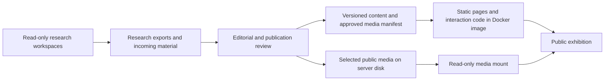

# Panzonato — exhibition concept and architecture

**Status: approved design implemented and expanded from the archive; local Docker review complete.** On 19 September 2026 the user approved the refined HTML preview (“looks good proceed”), then requested a full repository audit and a richer exhibition with less repetitive imagery. Three Orca-coordinated workers audited history, genealogy, and media, then implemented the expanded content. The integrated edition is tested in local Docker; results are recorded in [REVIEW.md](REVIEW.md). Public deployment remains a separate step.

The approved disposable preview remains at http://localhost:18774. The implementation uses a separate local address, http://localhost:18775. Preserve the approved Newsreader / DM Sans typography, paper / ink / iron-red / midnight-blue palette, chapter previews, journey transitions, photograph inspection, and finite motion. Do not reintroduce upward or diagonal arrow decorations.

The previous plan is preserved in [Agy’s original plan](work/design-review/PLAN.agy-original.md). Interview decisions and their history are in [the discussion record](work/design-review/DISCUSSION.md).

## 1. The idea

**A family history about leaving, arriving, and belonging.** Make someone with no connection to the Panzonato family want to follow the story from Italy to Brazil, then discover the people, places, and evidence behind it.

Working exhibition title: **Panzonato**. Working opening line: **Across an ocean. Through generations.** These are editorial proposals, not historical claims or final branding.

The reader should encounter human stakes before genealogical complexity. A document, a place, or a photograph can become the doorway into a chapter. The archive gives the story depth and credibility; each source is available close to the passage it informs.

Migration is the proposed narrative spine, carried forward as a working assumption when the user asked to proceed. Discoveries from the research provide secondary moments of intrigue. This is not a commitment to a predetermined story of success: the evidence must determine the account of departure, work, family, and change.

## 2. Decisions already made with the user

| Decision | Agreed direction |
| --- | --- |
| Primary audience | A curious newcomer with no family connection. |
| Relationship to other histories | Independent exhibitions, potentially connected by a shared entrance. |
| Current scope | Panzonato only. A separate agent owns Cardross. |
| Experience | Selective immersion within freely navigable pages. |
| Publication | Public exhibition containing selected stories and evidence. Research holdings remain outside the website. |
| Hosting and media | Self-host on the user's Docker server. Media stays in a separate, uncommitted folder and outside the website image. |
| Work sequence | Disposable HTML preview → user design approval → implementation through Orca-coordinated agents → local Docker verification and final review. |

Cardross, the shared gallery, private accounts, a research administration interface, and exhaustive historical research are outside this implementation plan. The Panzonato site can later expose a simple link to the gallery without depending on the other project's technology or deployment.

## 3. What changes from Agy’s plan

| Original approach | Revised approach | Reason |
| --- | --- | --- |
| Generic archive portal leads the project | A self-contained Panzonato exhibition leads | Matches the corrected scope and gives the work a clear identity. |
| Nine sections mix narrative, tree, timeline, and documents | Five proposed story chapters, with people and evidence accessible separately | Maintains narrative momentum and supports exploration. |
| Obsidian, gold, crest, four fonts, metadata chips | Spacious documentary design, two type families, actual archival material | Distinction comes from composition and material, with less ornamental ceremony. |
| Entire story translated through client-side replacements | Rendered language editions with stable URLs | Supports sharing, indexing, direct entry, and reading without JavaScript. |
| Copy source folders into public assets | Publish an explicit selection of approved records and derivatives | Keeps research holdings separate from the public exhibition. |
| One flat image size ceiling | Responsive reading images plus suitable inspection copies | A hero photograph and handwritten certificate serve different purposes. |
| Vercel hosting and bundled archive assets | A static Docker web image plus separately mounted public media | Matches the user's server choice and keeps large media out of Git and image rebuilds. |
| Build every page, then test | Validate one complete reading and evidence journey first | Establishes the design and interaction rules before migration expands. |
| Compression estimates and HTTP 200 checks define success | Measurable reading, navigation, accessibility, asset, and performance checks | A technically reachable page still needs to be usable and compelling. |

## 4. Art direction: a documentary with the intimacy of a book

### Visual language

- **Paper:** warm mineral white, approximately `#f3efe6`, for comfortable reading.
- **Ink:** near-black green, approximately `#202923`, for text and structure.
- **Signal:** restrained iron red, approximately `#a84632`, for current chapters and editorial emphasis.
- **Depth:** midnight blue, approximately `#142d38`, for occasional immersive passages such as the crossing.
- **Type:** Newsreader for literary display and reading, paired with DM Sans for navigation and captions. The user likes this pairing and the current palette; retain both. Check licenses and language coverage before self-hosting the production fonts.
- **Composition:** generous margins; an asymmetric opening; broad photographic spreads; narrow prose columns; carefully placed captions and marginal notes. A reader should be able to distinguish a chapter opening, a reading passage, and a source immediately.
- **Images:** authentic photographs and documents, visually inspected and captioned. Preserve their character. Editorial crops must offer access to the full image when the crop affects interpretation.
- **Evidence:** factual authority comes from a source and its context, not from stamps, invented heraldry, or a decorative seal.
- **Controls:** use text, active markers, and fine rules. Remove upward/diagonal arrow decorations from actions and chapter rows, following the user's feedback.

The design should alternate scales: a large title, a broad image, a quiet paragraph, then a revealing detail. Every chapter should not repeat the same hero-plus-card-grid layout.

### Directions considered and discarded

| Direction | Why it was attractive | Why it is not the overall design | What survives |
| --- | --- | --- | --- |
| Gilded museum | Gravity, permanence, institutional care | Ceremonious; gold and heraldic cues can overshadow ordinary lives | Precise captions, generous space, careful presentation |
| Full cinematic epic | Memorable opening and atmosphere | Scroll choreography dominates navigation and increases production demands | A few deliberate chapter openings and one signature interaction |
| Family scrapbook | Affection and personal connection | Faux paper, tape, and aging blur archival material with decoration | Small, clearly attributed personal notes |
| Genealogy application | Efficient relationship lookup | The newcomer meets complexity before human stakes | A focused family explorer after people have been introduced |

The original comparison study remains in `work/design-review/design-directions.html`. The Panzonato-specific discussion study is `work/design-review/panzonato-exhibition.html`. They are design material, not production pages.

## 5. Visitor experience

### Opening page

1. **Recognizable identity:** Panzonato, a short description, and language choice.
2. **Immediate invitation:** one strong headline, an authentic contextual image, and a brief premise. Primary action: **Begin the story**. Secondary action: **Choose a chapter**.
3. **Fosca and the six children:** a prominent story about the practical demands of care during an ocean crossing, grounded in the recorded household and clearly identified historical reconstruction. An attributed interview excerpt opens a second way into the wider immigrant experience.
4. **A readable chapter index:** five distinct chapter entrances with titles and one sentence of context. Visitors can start anywhere; the arrival roster gives each family member a name and age.
5. **Historical collections:** image essays about Venice, life at sea, passage papers, arrival, work, and Capivari. Covers and image sequences are distinct; full images and evidence remain one interaction away.
6. **A human connection:** introduce a small number of people relevant to the narrative, with names and relationships explained in ordinary language.
7. **About the project:** concise authorship, research method, credits, and a corrections contact if the user later supplies one.

Do not lead with record counts, a surname search box, project status badges, or the complete family tree.

### Proposed chapter sequence

Titles are working labels. Existing research informs these containers; factual writing and final divisions can change when evidence arrives.

| Chapter | Editorial question | Existing material it can absorb |
| --- | --- | --- |
| 01 — The world left behind | What kind of life preceded the departure? | Origins, place, family, and relevant economic or social context |
| 02 — The crossing | What changed when the family left? | Departure, voyage, transport, and the available travel evidence |
| 03 — A life in Brazil | How did arrival become a life? | Arrival, settlement, work, relationships, and changes of place |
| 04 — Through generations | What was carried forward, and what changed? | Individual lives, family connections, names, memories, and later movements |
| 05 — Looking back | How is this past encountered and understood now? | The return visit, surviving places, rediscovery, and open questions |

The tree, chronology, and archive from the former chapters become supporting ways to explore. They do not interrupt the story as compulsory chapters.

### Chapter template

A chapter has an opening image or object, a short introduction, readable sections, evidence at the relevant passage, and a clear onward link. Show chapter position and access to the contents. The current section may appear in a quiet desktop margin; mobile uses a compact contents disclosure.

Use a separate, directly addressable page for each chapter. The overview provides a concise complete arc for visitors who do not read every page. Browser Back should behave normally. Preserve a reader's position when opening and closing evidence.

### Navigation

Top-level navigation: **The story / Voices / Collections / People / Archive**. Voices opens shorter stories: Fosca, the Colombo, emigrant testimony, a letter, and objects. Collections are ordered visual essays. Both have equivalent EN/PT-BR URLs, chapter connections, and onward navigation. Places and chronology remain available from relevant chapters and the journey component. About, methodology, and the future gallery link belong in secondary navigation.

The people section begins with approachable portraits and a compact generational outline. A full pan-and-zoom graph is deferred; it is not the first thing a reader must understand.

## 6. Selective immersion

### Signature interaction: follow the journey

The story has a modest journey companion. Selecting a supported stage changes the highlighted place, associated image, and short contextual passage. On suitable desktop chapters, the companion can remain alongside the prose; mobile presents a compact stage selector and the selected view in normal flow.

The eventual geographic view uses sourced coordinates and published map geometry. Confirmed endpoints do not establish the exact voyage track: mark illustrative connections as approximate, avoid invented intermediate stops, and explain uncertain locations in the associated text. Do not imply that animation reveals more precise history than the research supports.

For the design study, a location-and-image selector demonstrates the rhythm without asserting a researched geographic route.

### Evidence inspection

A source reference opens a local preview: full image, relevant detail if available, transcription or accessible description, attribution, and what it supports. A separate source page supports direct links and sharing. On desktop this can be a side panel; on mobile it can expand in the page. Closing returns focus and reading position to the trigger. When JavaScript is unavailable, the reference remains a normal link to the source page.

### Motion rules

- Natural scrolling; no wheel interception, drag-only navigation, required sound, or forced introductory sequence.
- Give the page a richer motion vocabulary: a brief staggered opening, one-time section reveals, changing chapter previews, an animated journey stage marker, photograph crossfades, and a graceful evidence-viewer entrance. Motion should explain what changed and make exploration rewarding.
- Keep transitions brief and the reading layout stable. Reading text is visible by default; a failed reveal script must not hide content.
- No automatic loops or decorative parallax on every image.
- Reduced motion preserves the same information and controls using immediate state changes in both CSS and JavaScript, including changes to that preference during a visit.
- The story remains complete when interactive features do not load.
- Rapid selections must resolve to the latest selected chapter/place without stale images or mismatched captions. Images open at full view, with keyboard-accessible zoom and ordinary scrolling for inspection; closing restores the exact trigger's focus.

## 7. Content approach

Use a restrained third-person documentary voice, with occasional attributed curator or family notes. This is a working default, not a claim that any particular memory exists.

Every chapter should have a question, a small number of supported developments, a memorable piece of material, and a reason to continue. General historical context should explain a particular situation. Keep detailed research discussions available without requiring every visitor to read them.

Distinguish these forms in both data and presentation:

- **Documented family fact:** linked to the relevant record or source passage.
- **Historical context:** explains the broader world; does not establish what an individual personally experienced.
- **Attributed memory:** identifies whose account it is and how it was recorded.
- **Interpretation or uncertainty:** says what is inferred, disputed, approximate, or unknown.

Avoid invented dialogue, thoughts, motives, quotations, and heroic absolutes. The old line about carrying only children and courage should not migrate as fact. A contextual image must not be captioned as depicting the family. Do not fabricate photoreal historical scenes as archival evidence.

The relationship between migration, labour, land, and the wider society deserves specific, sourced treatment. Do not turn difficult history into decorative atmosphere. Research agents supply the facts; the design provides room for nuance.

The user-selected historical monograph supplies the narrative arc for the expanded origins, crossing, and Brazil chapters. Its individual claims are checked against family records and attributed historical sources. Fosca's caregiving is an explicitly conditional reconstruction; the letter and interviews identify other immigrant families. The Colombo's later photograph is dated 1901. Source-method detail stays in context notes and source pages so the main reading can remain close to people and ordinary life.

Stories use `src/data/features.json`, historical image sequences use `src/data/collections.json`, and both resolve existing catalog/media IDs. Native disclosure elements reveal translations without depending on JavaScript. No new framework or media service is required.

## 8. Architecture

### Delivery

Use Astro with static page generation and TypeScript. Select and pin a supported stable version when implementation begins; do not preserve the original Astro 5 pin automatically. Add browser JavaScript only to components that need it. A front-end framework can be introduced for a demonstrably complex interaction, but is not a baseline dependency.

**Self-host on the user's Docker server.** Build the Astro pages in a Node build stage and copy only the static output into a small web-server image. Nginx is the working default for static serving; its integration with the server's reverse proxy is settled during deployment. No Vercel adapter or hosted media service is required by this design.

Keep application releases and media storage separate. Code, public content metadata, and the media manifest are versioned. Archive photographs, scans, videos, and document binaries live in ignored local folders and on persistent server storage. Only the selected public media directory is mounted read-only into the web container, served at `/media/`; the raw archive is not mounted by that container. Bind mounts refer to the Docker host's filesystem, so local media must be transferred to the server separately. See [Docker's bind-mount documentation](https://docs.docker.com/engine/storage/bind-mounts/) and [the media-storage specification](MEDIA_STORAGE.md).

The existing local `assets/` collection stays in place and is ignored. A separate ignored `media/` folder holds future `originals/` and `published/` material. The application image must not contain either archive. `.dockerignore` excludes the binaries and local design studies from the build context independently of `.gitignore`.

### Content flow



Research exports and archive binaries are outside the site build inputs. The website consumes curated text and an approved media manifest. The build rejects unpublished or unknown record/media references; a separate media validation step checks that the manifest's files and checksums are present in the published folder before release. Do not make the normal application image build depend on reading the original archive.

### Content model

Use Markdown for prose, MDX only where a chapter needs composed components, and validated structured records for relationships. Keep stable IDs separate from displayed names and localized slugs. No graph database, custom CMS, or runtime content service is required for the first version.

| Record | Required purpose and relationships |
| --- | --- |
| Story/chapter | Localized title, summary, body, order, hero media, linked people/places, and claim-level source references |
| Person | Stable identity, name variants, publication selection, supported relationships, source references, and optional localized biography |
| Place | Name variants, appropriate date/context, source-backed location precision, and related events or stories |
| Event/journey stage | Supported date or date range, people, place, source references, uncertainty, and display order |
| Source | Citation, repository or institution where known, original locator, relevant page/region, and relationship to supported claims |
| Media | Stable ID, relative public paths for content-versioned variants, dimensions, file sizes/checksums, localized alt/caption, image role, credit/rights, and optional focal point; original filesystem references stay in the private ingest index |

Narrative assertions need a relevant citation, not just an undifferentiated source list in the footer. Relationship claims also require source references. Do not impose a fixed six-generation limit on the model.

Astro content collections support schema validation and references between entries; see the [official content collections guide](https://docs.astro.build/en/guides/content-collections/). A practical input contract is provided in [RESEARCH_HANDOFF.md](work/design-review/RESEARCH_HANDOFF.md).

### Illustrative project structure

```text
src/
  content.config.ts
  content/
    chapters/en/              # Published narrative editions
    chapters/pt-br/
    people/
    places/
    events/
    sources/
    media/                    # Versioned metadata/manifest, no archive binaries
  components/
    story/                    # Chapter opening, prose, figures, contents
    journey/                  # Stage selector and geographic view
    evidence/                 # Source reference, preview, document view
    people/                   # Portrait and family relationship views
  layouts/
    ExhibitionLayout.astro
    ChapterLayout.astro
    RecordLayout.astro
  i18n/                       # UI labels, locale paths, equivalent-page links
  pages/[locale]/             # Generated overview, chapters, people, archive
public/
  fonts/                      # Small application-owned assets, license permitting
scripts/
  validate-publication.mjs
  prepare-media.mjs           # Offline media preparation, separate from site build
  validate-media.mjs           # Verifies a published folder against the manifest
deploy/                       # Web-server configuration
Dockerfile                    # Static-site build and serving stages
compose.yaml                  # Host-media mount and server configuration
assets/                       # Existing archive; ignored by Git and Docker
media/                        # Local media root; ignored by Git and Docker
  originals/                  # Never served by the website
  published/                  # Selected public media only
work/design-review/           # Markdown planning; embedded-image HTML is ignored
```

The application and Docker setup are implemented. The illustrative structure above expresses the architecture; [README.md](README.md) lists the actual entry points, including `src/data/catalog.json`, `src/data/media.json`, and the shared Astro layout. Server media can live outside the checkout, for example at `/srv/panzonato/media/`, configured through an untracked environment file. Components should follow actual repeated design patterns, rather than splitting every visual element into an abstraction.

### Routes and languages

Reserve `/en/` and `/pt-br/` editions, with stable chapter and record URLs beneath each. Exact hosting base paths remain configurable so the exhibition can stand alone or sit beneath a future gallery. Do not build Cardross routes in this project.

Render narrative text in its page language. Translation dictionaries hold interface labels, not hundreds of paragraphs. Set the page language, metadata, canonical URL, and alternate-language references consistently. The language link opens the equivalent chapter or record; browser preference can suggest a language at the entrance but must not override an explicitly requested locale URL.

Store translation status. An untranslated item must not silently masquerade as Portuguese: label a fallback and link to the available edition, or omit the unpublished translation. See [Astro’s internationalization guide](https://docs.astro.build/en/guides/internationalization/).

### Images and documents

Keep source workspaces read-only. Preserve source originals and create the exhibition's chosen derivatives with a separate offline preparation command. Reading images get suitable responsive sizes and explicit dimensions; below-the-fold assets load lazily. The main opening image is prioritized. Document inspection may require a larger on-demand image or a selected facsimile; do not apply one global 1800-pixel ceiling.

Use one offline image pipeline, with Sharp as the working choice, to write variants into the external published media folder and produce manifest metadata. Astro renders normal image/picture URLs, dimensions, and `srcset` from that manifest. It should not import archive files into `src/assets`, copy them into `public/`, embed them as data URLs, or regenerate them during every code build. This replaces the earlier proposal to bundle the collection through Astro's asset handling.

Default the public URL prefix to `/media/`, configurable for another origin later. Local development must serve the selected public directory under the same route or proxy to a local static media server. Use content-versioned filenames and suitable cache headers; support large-file and range requests for document/video inspection as needed. Original scans and private ingest indexes remain outside the serving root.

Before a release, transfer missing media files to the host, verify the manifest against the published directory, then deploy the matching website image. Keep media referenced by rollback releases. Back up media independently of Git and container images. Adding new narrative or changing references still rebuilds static pages; existing binaries do not need to be repackaged. Detailed folder and release rules are in [MEDIA_STORAGE.md](MEDIA_STORAGE.md).

## 9. First build, after design agreement

### Step 1 — Establish the visual system

Build the Panzonato shell and one chapter composition using a small approved or explicitly marked fixture set. Establish the separate local media route and manifest input. Validate desktop and mobile typography, navigation, image treatment, and Portuguese text expansion.

### Step 2 — Prove one complete visitor journey

Implement **opening → chapter → source preview → full source page → return to reading → next chapter**. Include one person connection and equivalent-language navigation. Build the journey stage selector with a static fallback. This is the first reviewable slice.

### Step 3 — Expand the story and supporting records

Apply the validated patterns to the remaining chapters, selected people, and archive entries. Integrate research exports through the agreed content contract. Use representative incomplete, uncertain, and translated records during verification. Add simple archive filters only if the collection warrants them; global search is deferred until it solves an observed discovery problem.

### Step 4 — Refine and verify

Evaluate narrative pacing, mobile layouts, meaningful focus behavior, reduced motion, slow loading, and source readability. Verify the Docker image can be built without archive binaries and can serve the selected external media through a read-only mount. Prepare a preview for user review. Production publication is a later action; do not conflate approving this plan with deployment or pushing to a remote repository.

## 10. Acceptance criteria

These are targets for implementation, not claims about the current design study.

- The opening explains the subject and offers a clear story entrance without requiring prior family knowledge.
- A visitor can reach any chapter, understand their current position, and move backward or forward using ordinary browser behavior.
- Core narrative, contents, sources, and person relationships remain readable without JavaScript.
- The journey control changes the selected stage and associated material; motion and geography do not overstate the evidence.
- Evidence opens with an accessible name, usable controls, correct focus handling, and a complete direct-link fallback. Returning preserves reading context.
- EN and PT-BR pages have deliberate equivalent-page navigation; missing translations are visible and handled consistently.
- Layouts work at 360px, 768px, and desktop widths, at enlarged text sizes, by keyboard, and with reduced motion. No essential content depends on hover.
- Published record references, assets, source links, and captions are validated. No incoming research file, unselected civil document, or absolute private filesystem path is emitted into the site output.
- Git and the Docker build context exclude archive binaries, local media storage, and design-study HTML containing embedded images. The final web image contains the site but no archive-media payload.
- A fresh application checkout builds from versioned content and manifest metadata. A release validates required media against the separate server folder before activating the image. Recreating the container preserves media, and the serving mount is read-only.
- Set an initial target of at most 100 KB compressed first-load JavaScript on reading pages, excluding code explicitly loaded after opening an explorer. Avoid shipping a map library on every page.
- Target an opening-page LCP of 2.5 seconds or better under an agreed mobile test profile. Record the device/network settings and measurements; do not substitute a repository compression percentage for page performance.
- Confirm visual consistency through representative overview, chapter, person, and source pages, including long Portuguese labels and missing optional images.

## 11. Assumption ledger for final review

The following are defaults chosen during this planning work, not additional answers attributed to the user. Any veto reopens that decision.

| ID | Working choice | Reason |
| --- | --- | --- |
| A1 | Migration and its aftermath are the narrative spine; research discoveries enrich it | A clear invitation for a newcomer; follows the recommendation before the instruction to proceed |
| A2 | Third-person documentary voice with occasional attributed personal notes | Supports both intimacy and historical clarity without inventing a first-person narrator |
| A3 | Five proposed chapters, each on its own page, plus a concise opening overview | Allows short visits, deep reading, direct links, and manageable page weight |
| A4 | Warm paper, ink, iron red, occasional midnight blue; two type families | Establishes a recognizable Panzonato identity and concentrates visual drama |
| A5 | One signature journey interaction; source inspection remains a quiet supporting feature | Keeps the first version ambitious and achievable |
| A6 | EN and PT-BR launch editions | Retains the original bilingual requirement; material translation work is separate from design |
| A7 | Static Astro pages and validated content; Nginx as the provisional static web server | Docker hosting and uncommitted external media are now user decisions; the static serving choice remains a reversible default |
| A8 | Compact family outline first; advanced graph navigation and global search later | Gives newcomers approachable context and focuses the initial build |
| A9 | Working title “Panzonato”; sample headlines, chapter names, palettes, and fonts remain editable | Concrete art direction can be reviewed without prematurely locking naming |
| A10 | Read-only source folders; explicit public selection; a future gallery link only | Preserves originals, follows the public-only decision, and respects Cardross ownership |

The user accepted the planning direction, reviewed the throwaway HTML test, requested richer interaction, and approved the refined design. The reference remains in the ignored `work/panzonato-prototype/` folder, served through local Docker. The design gate is complete; implementation and the subsequent archive expansion were coordinated through Orca using cheaper agents.

## 12. Implementation record

The approved design now runs at http://localhost:18775/en/ and http://localhost:18775/pt-br/. The reference preview remains separate on port 18774. See [REVIEW.md](REVIEW.md) for the verified browser flows, build checks, Docker/media boundaries, and measured loading profile.

The expanded edition now draws on 193 distinct archival items identified by the repository audit. It presents five substantive chapters in each language, 65 selected media items, 97 sources, ten historic people, nine stories, six historical collections, and 25 timeline moments across 270 static pages. Homepage image roles remain distinct, and each chapter has its own lead and supporting gallery. Archive search and four source-type filters are implemented; the collection now warrants them. Family connections use sourced links among profiles, with generation groups providing orientation.

The source model supports both illustrated records and text-only references, localized excerpts and evidence notes, dates, and categories. Media remains external and uncommitted. The later certified extract of the 1891 family entry is labeled as a 2002 reproduction; contextual scenes remain separate from personal evidence. See [ARCHIVE_AUDIT.md](ARCHIVE_AUDIT.md) for corrected catalog captions and documentary findings.

This is still a local preview: final translation and publication-rights review precede public release. No public deployment or push has occurred.


## Historical forces in the timeline — 19 September 2026

The timeline now places the family milestones within the changes that made emigration more urgent or more reachable. Thirteen contextual events cover the Atlantic slave-trade suppression, Veneto joining Italy, the milling tax, grain competition, coffee demand and rail expansion, the Jacini inquiry, the September 1882 Brenta flood, passage assistance, organized recruitment, the Brás hostel, Lei Áurea, the Brazil/Colombo service and the 1890 immigration decree.

All 12 family milestones remain. Historical entries explain a consequence and link to every supporting source. Both editions share a chronological sequence with optional Family / Wider world filters; native disclosures remain readable without JavaScript. Red and blue markers distinguish the strands without changing the approved typography and palette. Periods remain periods, and partial dates retain only their supported precision.

Regional conditions establish pressures and opportunities, not Giuseppe and Fosca's private motives. The flood is not presented as proven damage to their home; the milling tax ends before their departure; immigration recruitment precedes the 1888 abolition law. No new media or original-research edits are needed for this expansion. Final checks are recorded in REVIEW.md.

## Animated atlas crossing — 19 September 2026

The user supplied a high-resolution Rand McNally world map and requested a moving boat from Genoa to Santos inside “Eight names. One crossing.” The implementation uses an Atlantic crop of that actual 1903 scan, with a calibrated SVG route through Gibraltar and Lisbon to Rio and Santos. It preserves the eight recorded family names and ages beside the map. Playback, pause, replay, progress scrubbing, port stops and flat/tilted views are progressive enhancements; the map and route remain readable without JavaScript.

The display illustrates the Colombo’s regular service. Its date and source links keep it separate from the family’s exact itinerary, which the arrival entry does not establish. The original and responsive WebP derivatives remain ignored and outside the app image, served through the separate read-only Docker media mount. Final review evidence is recorded in REVIEW.md.
